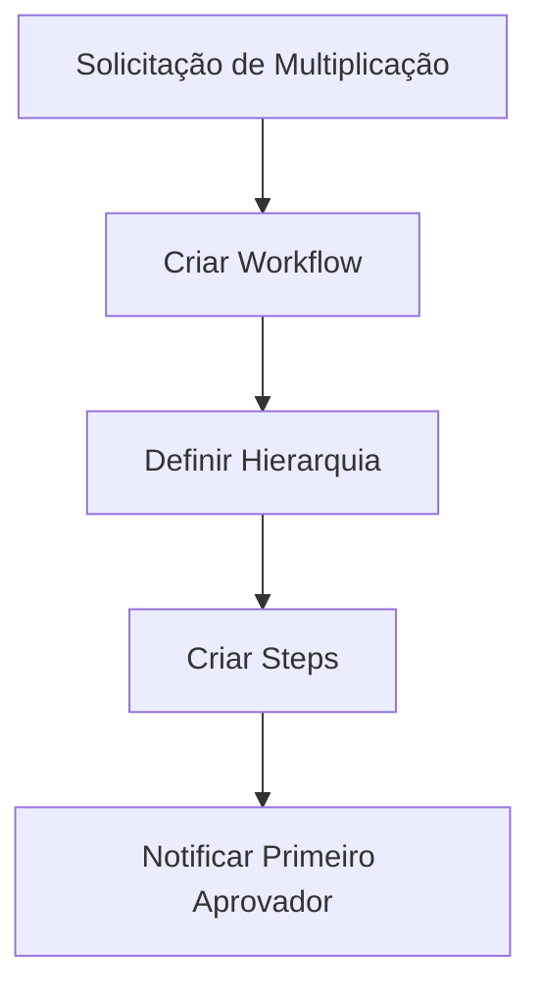
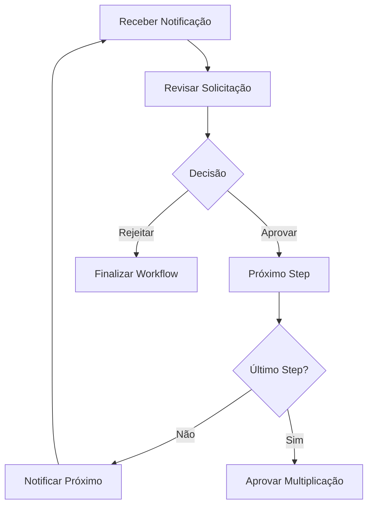

# Sistema de Workflow de Aprovação Hierárquica

## Visão Geral

O Sistema de Workflow de Aprovação Hierárquica é uma implementação completa para gerenciar processos de aprovação multi-nível seguindo a hierarquia da Visão G12. O sistema permite validar e aprovar processos como multiplicação de células, promoções de liderança e outras decisões importantes da igreja.

## Características Principais

### 🔄 Workflows Configuráveis
- Hierarquia de aprovação personalizável por igreja
- Múltiplos tipos de workflow (multiplicação, promoção, criação de célula, orçamento)
- Steps automáticos e manuais
- Configuração de timeout e escalação

### 👥 Sistema de Papéis Hierárquicos
- **Pastor**: Nível mais alto de aprovação
- **Supervisor**: Supervisa células e líderes
- **Líder**: Líder de célula
- **Timóteo**: Líder em treinamento
- **Membro**: Membro regular

### 📱 Interface Intuitiva
- Dashboard de aprovações pendentes
- Notificações em tempo real
- Aprovações rápidas
- Histórico detalhado
- Métricas de sucesso

### 🔔 Sistema de Notificações
- Notificações automáticas por step
- Lembretes de expiração
- Notificações de conclusão
- Integração com sistema existente

## Arquitetura do Sistema

### Banco de Dados

#### Tabelas Principais

**`approval_workflows`**
```sql
- id: UUID (PK)
- multiplication_id: UUID (FK)
- church_id: UUID (FK)
- workflow_type: ENUM
- current_step: INTEGER
- total_steps: INTEGER
- status: ENUM
- initiated_by: UUID (FK)
- workflow_config: JSONB
```

**`approval_steps`**
```sql
- id: UUID (PK)
- workflow_id: UUID (FK)
- step_number: INTEGER
- approver_role: ENUM
- status: ENUM
- approved_by: UUID (FK)
- approved_at: TIMESTAMP
- comments: TEXT
- expires_at: TIMESTAMP
```

**`approval_notifications`**
```sql
- id: UUID (PK)
- workflow_id: UUID (FK)
- step_id: UUID (FK)
- recipient_id: UUID (FK)
- notification_type: ENUM
- title: VARCHAR
- message: TEXT
- priority: ENUM
```

#### Views Úteis

**`pending_approvals`**: Lista todas as aprovações pendentes com informações essenciais
**`multiplication_history`**: Histórico completo de multiplicações com status

### API Endpoints

#### Workflows
- `POST /api/protected/approvals/workflows` - Criar workflow
- `GET /api/protected/approvals/workflows` - Listar workflows
- `GET /api/protected/approvals/{workflowId}` - Detalhes do workflow
- `PUT /api/protected/approvals/{workflowId}` - Cancelar workflow

#### Aprovações
- `GET /api/protected/approvals/pending` - Aprovações pendentes
- `POST /api/protected/approvals/{workflowId}/steps/{stepId}/process` - Processar aprovação

#### Histórico e Relatórios
- `GET /api/protected/approvals/history` - Histórico de multiplicações
- `GET /api/protected/approvals/metrics` - Métricas de sucesso

### Componentes React

#### `PendingApprovalsList`
Lista todas as aprovações pendentes organizadas por urgência.

```tsx
<PendingApprovalsList />
```

#### `ApprovalWorkflowDetail`
Visualização detalhada de um workflow específico com ações de aprovação.

```tsx
<ApprovalWorkflowDetail workflowId="uuid" />
```

#### `MultiplicationHistoryDashboard`
Dashboard completo com métricas e histórico de multiplicações.

```tsx
<MultiplicationHistoryDashboard />
```

#### `QuickApprovalNotification`
Componente compacto para notificações rápidas.

```tsx
<QuickApprovalNotification compact={true} showActions={true} />
```

### Hooks Personalizados

#### `useApprovals`
Hook principal para gerenciar aprovações com real-time.

```tsx
const { 
  approvals, 
  loading, 
  processApproval, 
  createWorkflow 
} = useApprovals();
```

## Fluxo de Aprovação

### 1. Criação do Workflow


### 2. Processo de Aprovação


### 3. Estados do Workflow
- **pending**: Aguardando aprovações
- **approved**: Totalmente aprovado
- **rejected**: Rejeitado em algum nível
- **cancelled**: Cancelado pelo solicitante
- **expired**: Expirou sem aprovação

## Configuração

### Hierarquia Padrão de Multiplicação
```json
{
  "approval_hierarchy": {
    "multiplication": [
      {
        "step": 1,
        "role": "supervisor",
        "required": true,
        "timeout_hours": 72
      },
      {
        "step": 2,
        "role": "pastor",
        "required": true,
        "timeout_hours": 72
      }
    ]
  }
}
```

### Configuração Personalizada
As igrejas podem personalizar a hierarquia através das configurações:

```typescript
interface ChurchApprovalConfig {
  approval_hierarchy: {
    multiplication: ApprovalHierarchyStep[];
    leadership_promotion?: ApprovalHierarchyStep[];
  };
  notification_settings: {
    send_email: boolean;
    reminder_intervals: number[];
  };
  expiration_settings: {
    default_timeout_hours: number;
    auto_escalate: boolean;
  };
}
```

## Funcionalidades Avançadas

### 1. Real-time Updates
O sistema usa Supabase real-time para atualizações instantâneas:
- Novos workflows aparecem automaticamente
- Status de aprovação atualiza em tempo real
- Notificações são sincronizadas

### 2. Sistema de Métricas
Acompanha indicadores importantes:
- Taxa de sucesso de multiplicações
- Tempo médio para aprovação
- Células ativas pós-multiplicação
- Crescimento médio das novas células

### 3. Auditoria Completa
Todo o processo é auditado:
- Histórico de cada aprovação
- Comentários e motivos de rejeição
- Timeline completa do workflow
- Relatórios exportáveis

### 4. Notificações Inteligentes
- Lembretes automáticos antes da expiração
- Escalação para roles superiores
- Notificações prioritárias para casos urgentes
- Integração com sistema de notificações existente

## Uso Prático

### Para Líderes de Células
1. Iniciar processo de multiplicação
2. Aguardar notificações de aprovação
3. Acompanhar progresso em tempo real
4. Receber feedback dos aprovadores

### Para Supervisores e Pastores
1. Receber notificações de aprovações pendentes
2. Revisar detalhes da multiplicação
3. Aprovar ou rejeitar com comentários
4. Acompanhar métricas de sucesso

### Para Administradores
1. Configurar hierarquias personalizadas
2. Monitorar workflows em andamento
3. Gerar relatórios e análises
4. Configurar notificações e timeouts

## Segurança e Permissões

### Row Level Security (RLS)
Todas as tabelas implementam RLS para garantir:
- Usuários só veem dados de sua igreja
- Aprovadores só processam workflows de sua competência
- Auditoria completa de acessos

### Validação de Permissões
```sql
-- Exemplo de validação de permissão
CREATE OR REPLACE FUNCTION check_approval_permission(
  p_user_id UUID,
  p_required_role profile_role,
  p_church_id UUID
) RETURNS BOOLEAN
```

## Manutenção e Monitoramento

### Logs e Auditoria
- Todos os workflows são registrados
- Ações são logadas com timestamp
- Relatórios de auditoria disponíveis

### Performance
- Índices otimizados para consultas frequentes
- Views materializadas para relatórios
- Cache de notificações pendentes

### Backup e Recovery
- Backup automático de workflows críticos
- Possibilidade de restaurar estados anteriores
- Redundância de notificações importantes

## Extensibilidade

O sistema foi projetado para ser extensível:

### Novos Tipos de Workflow
```typescript
// Adicionar novos tipos facilmente
type WorkflowType = 
  | 'multiplication'
  | 'leadership_promotion'
  | 'cell_creation'
  | 'budget_approval'
  | 'new_workflow_type'; // Nova funcionalidade
```

### Integrações Externas
- API para sistemas de email
- Webhook para integrações
- SDK para aplicações mobile

### Customização por Igreja
- Templates de aprovação salvos
- Configurações específicas
- Branding personalizado

## Conclusão

O Sistema de Workflow de Aprovação Hierárquica fornece uma base sólida para gerenciar processos de aprovação complexos na estrutura G12, garantindo transparência, auditoria e eficiência no processo de multiplicação de células e outras decisões importantes da igreja.